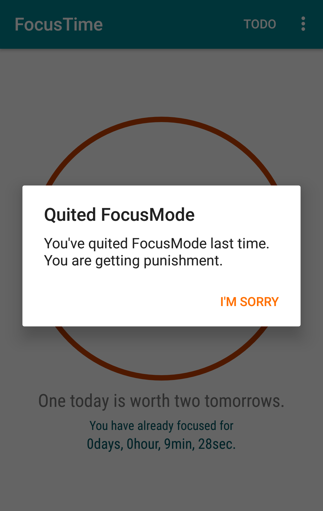

# FocusTime
## Part 0: Product Overview
FocusTime is an Android app that helps you avoid distractions of your phone by disabling a list of apps in a time period set by you. You will get punished one-minute-long annoying music if you failed to be focused during that time period. Feeling interested? Explore more on FocusTime <a href="https://www.youtube.com/watch?v=pva4EdHzUVc&t=15s">in one video</a>!

## Part 1: Features

 

### 1.1 Blacklisted apps
A list of apps will be provided by FocusTime and you can select a list of apps that you don't want to be distrated by. + 
Then you can set a timer. + 
When the timer starts, those apps on the blacklist will be disabled. 
 If you try to open a blacklisted app, FocusTime will force to close it.

 

 However, system pre-installed apps can still function normally even after the timer starts.

### 1.2 Punishment
Once the timer starts, if you want to quit it, you will get a punished by a one-minute-long annoying music.

 

 

Even if you want to force FocusTime to quit by removing from Recent application list by swiping, you will still get punishment when you re-open the app.

 

### 1.3 Reminder

There is an reminder reminds you to set the blacklisted apps before you start a timer. +
You can choose to turn it off. +

 

And you can turn it on again in the settings. 

 

### 1.4 Motto

You can also customize your motto in the settings.

 

### 1.5 Todos
In FocusTime, you can create a Todo list for managing your work. +

* You can click the plus button to create a new Todo. +
* You can click on a Todo to edit it. +
* You can swipe to delete a Todo.

 

## Part 3: Chinese version 寸金寸光阴

Both English and Chinese version is supported by FocusTime. The default one is English. +
FocusTime will automatically adapt to your phone language. If your phone language is not English or Chinese, the English version will be displayed.

 

## Part 4: How to use

You can always refer to "How to use" page to know how to use FocusTime.

 

